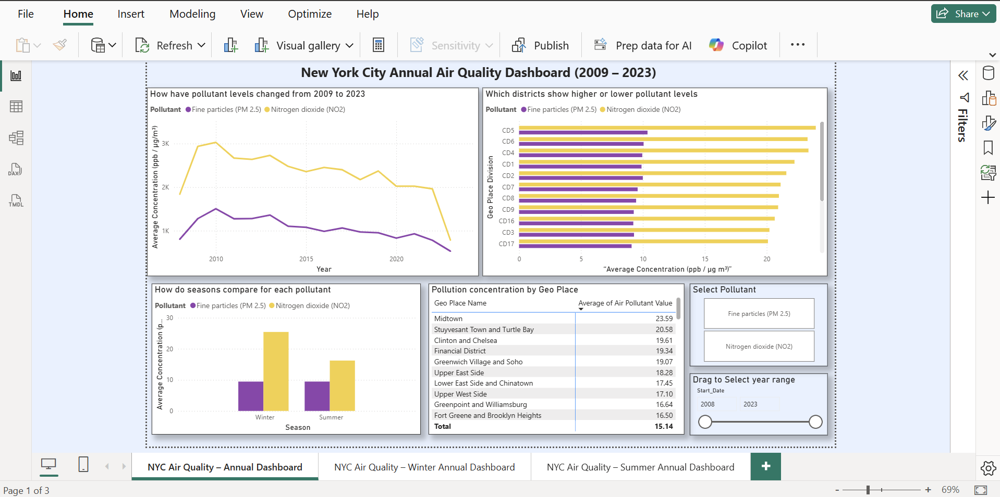
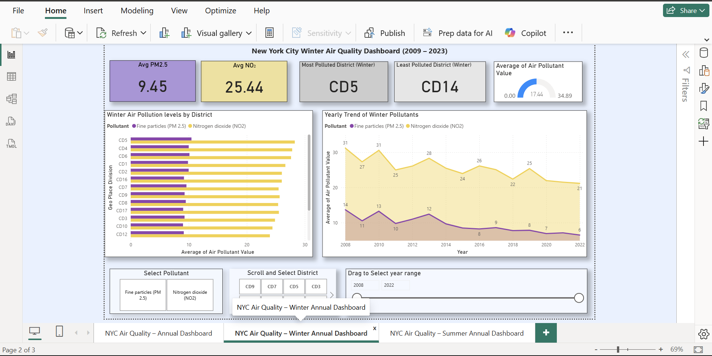
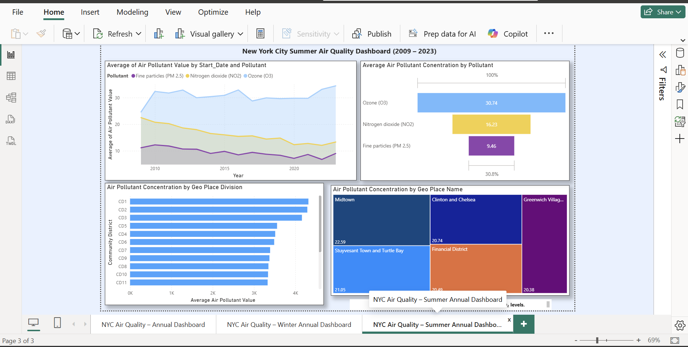

# NYC Air Quality Analysis (2009 to 2023)

### A full analytics project on New York City's air pollution, from raw data to a live presentation

**By Vamshi Aitharaju**

`Excel` `Power Query` `Python` `RapidMiner` `Power BI` `Statistical Testing` `Forecasting` `Machine Learning` `Data Storytelling`


*The infographic used to lead a live 90 minute presentation for university faculty, students, and outside guests. The project earned top marks in the course.*

---

## The Question

NYC's Department of Health has published over a decade of air quality data, broken down by pollutant, season, and neighborhood. Almost nobody looks at it closely. This project set out to actually use it, and to answer three questions that matter for public health and city planning:

1. Which parts of the city have the worst air quality?
2. Does pollution change with the seasons, and if so, how much?
3. Is the problem getting better or worse over time?

To answer these, I worked with 18,862 pollution readings across 59 community districts and 15 years, focusing on the two pollutants with the most public health relevance: **nitrogen dioxide (NO2)** and **fine particles (PM2.5)**.

This README walks through every stage of that work: what I did, why I made each decision, and how I did it, including a mistake I caught and corrected along the way.

---

## Chapter 1: Cleaning the Data

**What I did:** I took the raw DOHMH dataset, which mixed together dozens of pollutants in inconsistent formats, and narrowed it down to a clean, structured dataset built around NO2 and PM2.5.

**Why:** The raw file combined many different pollutants, measurement types, and time periods in one sheet. Before any analysis could be trusted, the data needed real structure. NO2 and PM2.5 were the strongest choices because they had the most consistent measurement coverage and the clearest link to public health outcomes.

**How:** I used Power Query to filter, standardize, and reshape the data. NYC air quality data can be grouped by five different geographic levels (Borough, Community District, UHF34, UHF42, and Citywide). I chose Community District because it gave the finest level of detail while still being usable for pattern analysis. I then split the cleaned data into Annual, Winter, and Summer views to support seasonal comparison later on.

📄 [Read the full cleaning report](reports/01_Data_Cleaning_Report.pdf)

## Chapter 2: Exploring the Data

**What I did:** I ran a structured exploratory analysis across four angles: composition, comparison, relationships, and outliers.

**Why:** Before building any model, I needed to understand what the data was actually showing. This step is where real patterns get separated from noise, and where bad assumptions get caught early.

**How:** I built charts comparing pollutant levels by season and by year. One early idea, a bubble chart comparing all three original pollutants, didn't work: every bubble came out the same size and added nothing useful, so I dropped it. A more important finding came from a data completeness check: Ozone (O3) was only measured in the summer months, never in winter or as an annual average. Comparing it directly to NO2 and PM2.5 would have been comparing incomplete data to complete data, so I removed O3 from the year-round comparison and gave it its own dedicated summer analysis instead (more on that in Chapter 7).

 

*Left: seasonal comparison across the full dataset. Right: the 15 year trend for both pollutants.*

The clearest pattern to come out of this stage: NO2 spikes sharply every winter, while PM2.5 stays roughly the same all year round.

📄 [Read the full EDA report](reports/02_EDA_Report.pdf)

## Chapter 3: Testing the Pattern, and Fixing a Mistake

**What I did:** I ran formal hypothesis tests to confirm the seasonal NO2 pattern was real, and I re-checked an earlier correlation finding that turned out to be wrong.

**Why:** A pattern in a chart is not proof by itself. Hypothesis testing gives an actual statistical basis for saying a difference is real rather than random noise. Separately, when preparing this repository, I went back and rebuilt an important chart from scratch using the raw data, since I wanted every number in this project to be something I could stand behind.

**How:** The winter versus summer NO2 test came back with a p value near zero, well under the standard 0.05 threshold, confirming the seasonal spike is statistically real. PM2.5 showed no significant seasonal difference (p = 0.91), matching what the charts already suggested.

The correction: my original EDA report stated the correlation between NO2 and PM2.5 was almost zero (R squared around 0.006). When I rebuilt that chart directly from the underlying district level data for this repository, I got a very different result: R squared around 0.70, a real and moderately strong relationship.


*Rebuilt directly from the annual district level data. The two pollutants move together more than my original analysis found.*

This makes sense once you think about it. Districts with more traffic and higher density tend to have elevated levels of both pollutants, since they often share the same root causes. The original low number likely came from referencing the wrong chart or the wrong data range in a large, multi sheet workbook, an easy mistake in a project this size. I'm including both numbers here on purpose, instead of quietly replacing one with the other, because catching and correcting your own error is part of doing the work properly.

## Chapter 4: Forecasting with Python

**What I did:** I rebuilt the seasonal hypothesis tests in Python and built a forecasting model to project both pollutants through 2027.

**Why:** Getting the same result in two independent tools is a much stronger form of proof than getting it in one. Python also gave me the ability to build a proper time series forecast, which Excel could not do as cleanly.

**How:** I used `scipy.stats` to rerun every hypothesis test from Chapter 3, confirming the same conclusions. I then used `statsmodels` to build an Exponential Smoothing forecast for both pollutants, complete with 95 percent confidence intervals.

<table>
<tr>
<td></td>
<td></td>
</tr>
</table>

*Real model output. Both pollutants are trending down through 2027, with NO2 improving faster than PM2.5.*

Small differences between the Excel and Python forecasts turned out to come from rounding behavior between the two tools, something I confirmed by checking with a course TA. Two independent methods reaching nearly identical answers is what actually makes a forecast trustworthy.

📄 [Read the full Python report](reports/03_Python_Hypothesis_Forecasting_Report.pdf) or [view the code](code/)

## Chapter 5: Building Machine Learning Models

**What I did:** I built three machine learning models in RapidMiner to predict pollution levels based on season, pollutant type, and district.

**Why:** My first attempt was to forecast pollution by year, treating it purely as a time series problem. That model had nothing useful to say. The better question turned out to be a different one entirely: instead of asking when pollution will change, ask what actually explains it. Season, pollutant, and district turned out to be strong predictors.

**How:** I built and compared three models using a 70/30 train test split.

| Model | R squared | What it showed |
|---|---|---|
| Decision Tree (Gini Index) | 0.784 | Season is the single strongest predictor of NO2, splitting the data before anything else |
| Random Forest (100 trees) | 0.782 | Confirmed the Decision Tree's finding with more stability across districts |
| Linear Regression | 0.692 | A useful baseline, though pollution does not follow a purely linear pattern |


*Winter NO2, the exact variable the models flagged as most important, also shows the clearest forecasted improvement.*

📄 [Read the RapidMiner report](reports/04_RapidMiner_Report.pdf), the [Decision Tree explanation](reports/04a_Decision_Tree_Explanation.pdf), or the [Random Forest explanation](reports/04b_Random_Forest_Explanation.pdf)

## Chapter 6: Ranking the Districts

**What I did:** I ranked all 59 community districts by average NO2 concentration.

**Why:** Every method used so far, the charts, the hypothesis tests, and the machine learning models, kept pointing toward the same handful of locations. The clearest way to confirm that was to just rank them directly.

**How:** I calculated average NO2 by district across the full dataset and sorted from highest to lowest.


*Midtown, Stuyvesant Town and Turtle Bay, and Clinton and Chelsea rank highest. These are the city's most dense, most trafficked areas.*

## Chapter 7: Building the Interactive Dashboard

**What I did:** I built a three page Power BI dashboard, with separate views for Annual, Winter, and Summer data.

**Why:** A static chart shows one conclusion. A dashboard lets a user explore the data on their own terms, filter by pollutant or district or year, and find their own answers. I split it into three pages instead of one crowded page because winter and summer behave differently enough, and because summer has an extra pollutant that the other seasons don't, that combining them into a single view would have meant either losing detail or creating clutter.

**How:**

**Annual Dashboard**



The main overview page. It includes a 15 year trend line, a district by district ranking chart, a winter versus summer comparison, and a full ranked table of every district, all connected to a pollutant selector and a year range slider.

**Winter Dashboard**



A dedicated view for winter, since that is when NO2 actually spikes. KPI cards show the key numbers immediately: average PM2.5 of 9.45, average NO2 of 25.44, and the most and least polluted districts, CD5 and CD14. A district ranking chart and a yearly trend chart sit alongside slicers for scrolling through individual districts and years.

**Summer Dashboard**



Summer is the only season with Ozone (O3) data, which is exactly why O3 was excluded from the year round comparison back in Chapter 2 and exactly why it gets its own page here. The concentration chart shows O3 actually running higher than the other two pollutants in summer, and a treemap highlights Midtown, Clinton and Chelsea, and Greenwich Village as the summer hotspots.

## Chapter 8: Presenting the Findings

**What I did:** I combined every stage of this project, the cleaning, the exploration, the hypothesis tests, the forecasts, the machine learning models, the district rankings, and the dashboard, into a formal report, an eight slide presentation, and the infographic poster shown at the top of this page.

**Why:** None of the analysis matters if it stays inside a spreadsheet. The goal was to make the findings usable by people who don't work with data day to day.

**How:** The infographic became the anchor for a live 90 minute presentation to university faculty, students, and outside guests, walking through the findings district by district and chart by chart. The project earned top marks in the course.

📄 [Read the final report](reports/05_Final_Capstone_Report.pdf) or [view the presentation slides](presentation/The-Story-of-NYCs-Air-Quality.pdf)

---

## Key Findings

- Winter drives NO2 pollution upward, most likely due to heating fuel use, higher traffic, and cold air trapping pollutants near the ground
- PM2.5 stays roughly constant year round, making it a steady background risk rather than a seasonal spike
- NO2 and PM2.5 are more closely related than my original analysis showed, with a real relationship (R squared around 0.70) likely driven by shared traffic and density factors
- Pollution is not evenly distributed. Midtown consistently ranks highest, while outer districts rank much lower
- Both pollutants are trending downward through 2027 based on independent forecasts in both Excel and Python

## What I Would Recommend to a City Planner

- Focus NO2 reduction efforts specifically on winter months, through cleaner heating incentives, traffic restrictions on high pollution days, and real time air quality alerts
- Since NO2 and PM2.5 move together more than expected, traffic reduction policy is likely to improve both pollutants at once, not just one
- Prioritize future monitoring investment in the districts the data already points to, starting with Midtown

## Tools and Skills Used

Excel (Power Query, Pivot Tables), Python (Pandas, NumPy, SciPy, Statsmodels, Matplotlib), RapidMiner (Decision Tree, Random Forest, Linear Regression), Power BI (multi page reports, DAX measures, slicers, KPI cards, treemaps), Statistical Hypothesis Testing, Data Cleaning, Time Series Forecasting, Data Storytelling

## Repository Structure

```
assets: every chart, dashboard screenshot, and the infographic shown in this README
reports: all 7 written reports, as PDF
presentation: the final slide deck and infographic poster
code: the two Python scripts referenced in Chapter 4
```

Note on file formats: the original Excel workbooks, the Power BI file, and the RapidMiner model files are kept in a private archive. Every result they produced is fully documented above through reports, real code, and real screenshots. Nothing in this repository is a mockup.

---
### About the Author
**Vamshi Aitharaju**
Email: aitharajuvamshi@gmail.com
GitHub: [github.com/aitharajuvamshi-cell](https://github.com/aitharajuvamshi-cell)

All content in this repository, including analysis, writing, code, and visuals, is original work produced independently for BAN 586. Copyright 2026 Vamshi Aitharaju. All rights reserved.
