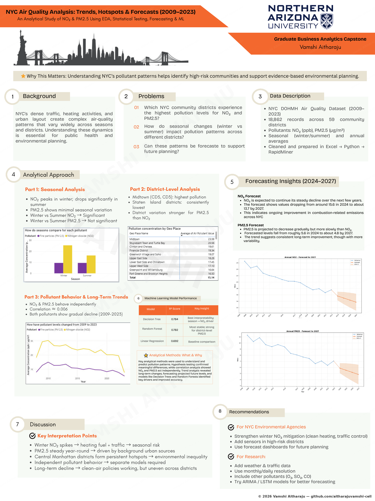
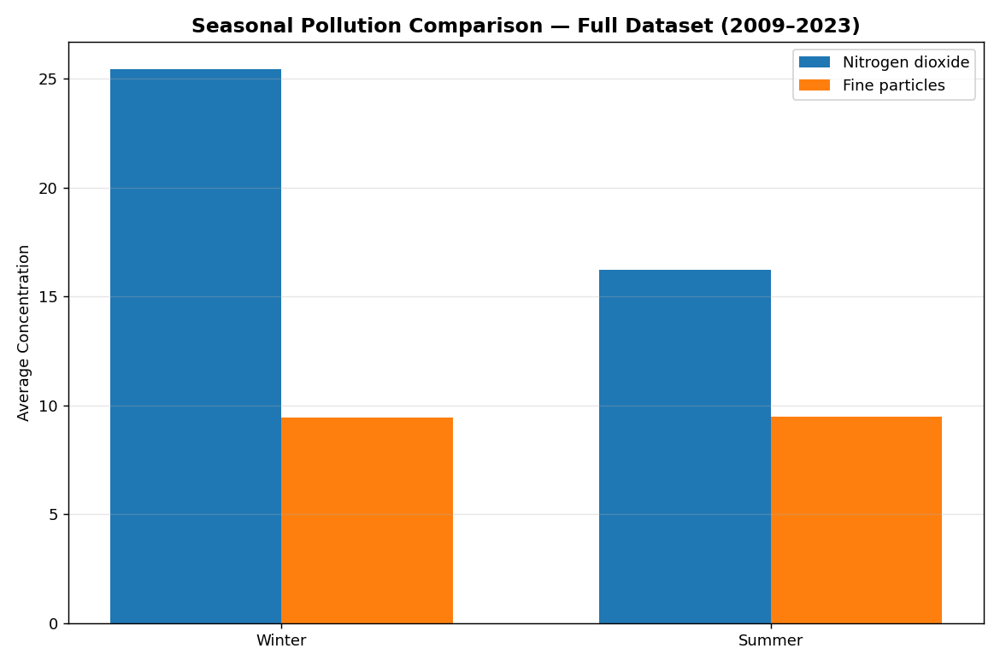
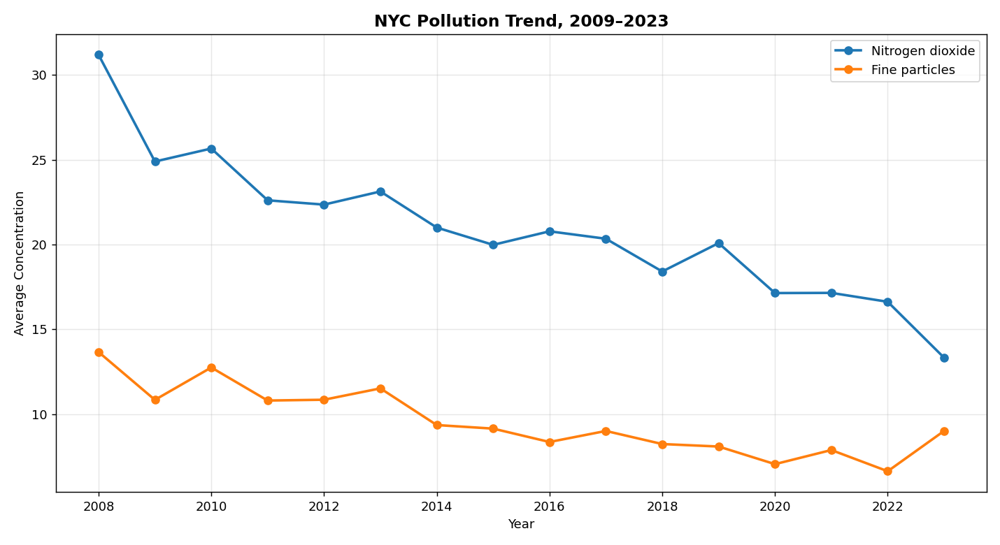
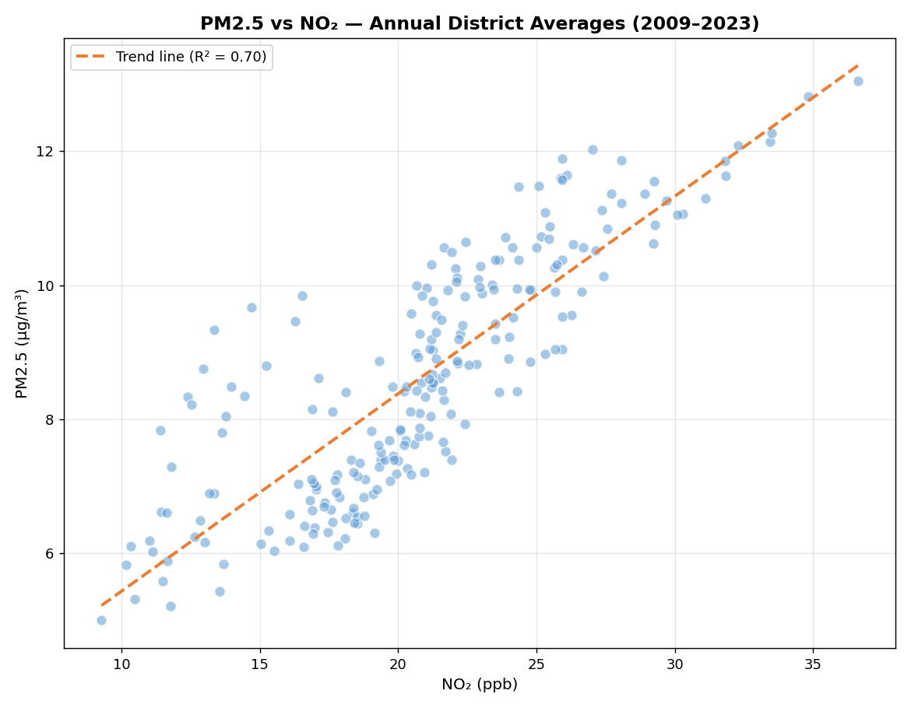
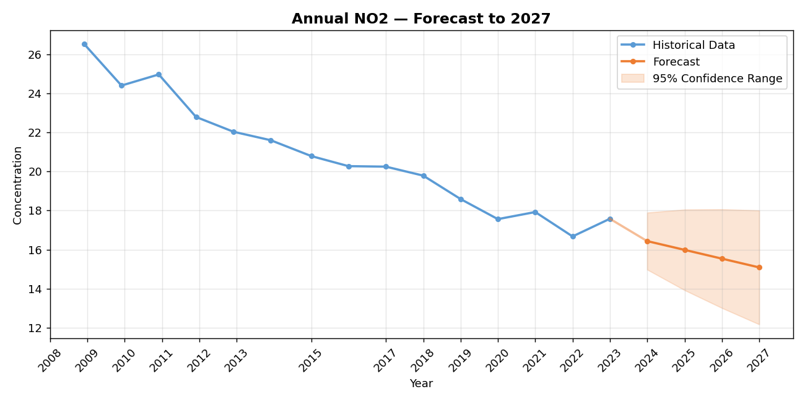
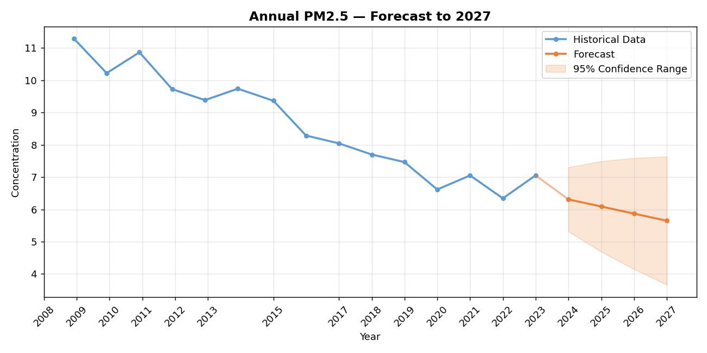
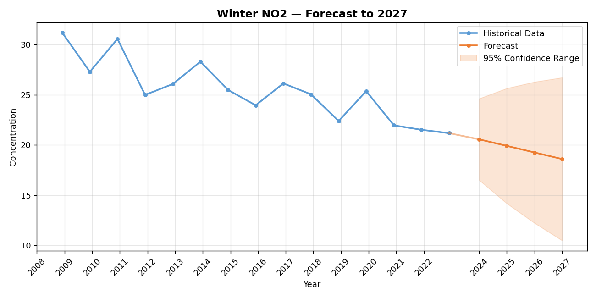
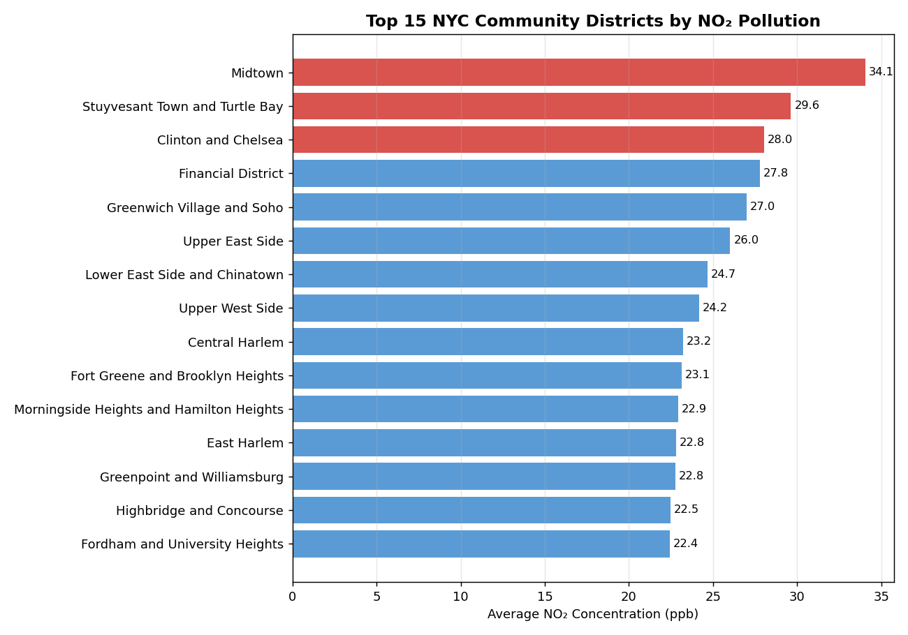

# 🌆 The Story of NYC's Air

### How 15 years of messy government data became a data story that filled a room

**BAN 586 Graduate Capstone — Northern Arizona University**
**By Vamshi Aitharaju**

`Excel` `Power Query` `Python` `RapidMiner` `Power BI` `Statistical Testing` `Forecasting` `Machine Learning` `Data Storytelling`


*The infographic that anchored a live 90-minute presentation to university faculty, students, and outside guests — the project earned top marks in the course.*

---

## The Question

Every New Yorker breathes the same city air — but not the same air. A resident of Midtown and a resident of Staten Island are exposed to meaningfully different pollution loads, in different seasons, for different reasons. NYC's Department of Health has been quietly measuring this for over a decade. Nobody had turned it into a story.

That's what this project set out to do: take 18,862 raw pollution readings across 59 community districts and 15 years, and answer three questions that actually matter to a city —

1. **Where** is the air worst?
2. **When** is it worst?
3. **Is it getting better?**

What follows is the real journey from raw numbers to a live presentation — including the dead ends, the moments the data didn't cooperate, and what actually changed my approach along the way.

---

## Chapter 1 — Taming the Data

The raw DOHMH file looked deceptively clean at first glance — 18,000+ rows, barely any nulls. But the closer look told a different story: pollutant readings, vehicle-miles-traveled, and death/hospitalization statistics were all mixed into the same sheet, in different units, like comparing apples to oranges. A pivot chart was the first real move — sorting the chaos into three buckets (pollutants, vehicles, deaths) before anything else could happen.

From there, the focus narrowed to **NO₂ and PM2.5** specifically — the two pollutants with the most consistent measurement coverage and the clearest public-health relevance. Even the geography took real digging: NYC air data gets sliced five different ways (Borough, Community District, UHF34, UHF42, Citywide), and choosing **Community District** — the finest practical resolution — was a deliberate call to make district-level hotspots identifiable later.
📄 [Read the full cleaning report →](reports/01_Data_Cleaning_Report.pdf)

## Chapter 2 — Listening to the Data

With clean data in hand, the next step was exploration across five angles: composition, comparison, relationships, outliers, and pivots.

 

*Left: seasonal comparison across the full dataset. Right: the 15-year story of both pollutants, told in one line chart.*

Not everything worked. A bubble chart comparing all three original pollutants got built and then scrapped — every bubble came out the same size, adding nothing. A more useful catch came from faculty feedback: **O₃ data only existed for summer months**, never winter or annual — comparing it directly would have been comparing incomplete data to complete data, so it was cut from the analysis entirely, narrowing the project's real focus to NO₂ and PM2.5.

The seasonal pattern was unmistakable: **NO₂ spikes sharply every winter**, while **PM2.5 stays remarkably steady year-round** — a genuinely different behavior for two pollutants people often lump together as "air quality."
📄 [Read the full EDA report →](reports/02_EDA_Report.pdf)

## Chapter 3 — Testing the Hunch, and Catching a Mistake

A pattern in a chart isn't proof. The winter/summer NO₂ gap went through formal hypothesis testing and held up completely — a p-value near zero, well under the 0.05 threshold. PM2.5's apparent seasonal steadiness held up too (p = 0.91 — no significant difference).

The original EDA also reported the two pollutants as essentially uncorrelated (R² ≈ 0.006). Revisiting that number directly against the raw district-level data for this write-up turned up something worth being upfront about: **the real correlation is closer to R² ≈ 0.70** — a meaningfully strong relationship, not a near-zero one.



*Recomputed directly from the underlying annual district data — NO₂ and PM2.5 move together more than the original analysis concluded.*

It makes physical sense once you sit with it: districts with heavier traffic and density tend to run higher on **both** pollutants, so a real relationship between them isn't surprising. The original number likely came from a mismatched chart reference in a large, multi-sheet workbook — an easy mistake to make and, honestly, a useful one to have caught. Re-checking your own analysis and correcting it is part of doing the work properly.

## Chapter 4 — Looking Ahead

Excel could describe the past. To look forward, the analysis moved into Python — partly for the horsepower, partly to independently verify the Excel findings in a second tool. Python wasn't a strength going in, so library selection leaned on AI assistance — but every test, every result, and every interpretation was built and checked by hand.

- **`air_quality_hypothesis.py`** re-ran every statistical test from scratch using `scipy.stats` — same conclusions, second tool, real confidence
- **`air_quality_forecasting.py`** built an Exponential Smoothing model projecting both pollutants out to **2027**, matching the same method already validated in Excel

<table>
<tr>
<td></td>
<td></td>
</tr>
</table>

*Real model output — both pollutants trending down through 2027. NO₂ is improving faster than PM2.5.*

The Excel and Python forecasts came out nearly identical, with only tiny decimal-level differences traced back to how each tool rounds internally — confirmed after checking with a course TA. Getting the same answer twice, in two independent tools, is what actually makes a forecast trustworthy.
📄 [Read the full Python report →](reports/03_Python_Hypothesis_Forecasting_Report.pdf) · 💻 [View the code →](code/)

## Chapter 5 — Building a Brain (After a False Start)

The first instinct in RapidMiner was to forecast pollution by year — a straightforward extension of the Python work. It didn't work; the model had nothing meaningful to say. Rather than force it, the question changed: instead of predicting pollution over time, **predict pollution from season, pollutant, and district** — three variables that actually explain *why* pollution varies, not just *when*.

That pivot is what made the models work:

| Model | R² | What it revealed |
|---|---|---|
| Decision Tree (Gini Index) | 0.784 | Splits first by pollutant, then season, then district — easiest to explain to a non-technical audience |
| Random Forest (100 trees, bootstrapped) | 0.782 | Confirmed the Decision Tree's story with more stability across districts |
| Linear Regression | 0.692 | A useful numeric baseline — season and district's effect on pollution, quantified |



*Winter NO₂ — the exact variable the models flagged as most important — also shows the clearest forecasted improvement.*

📄 [RapidMiner report →](reports/04_RapidMiner_Report.pdf) · [Decision Tree detail →](reports/04a_Decision_Tree_Explanation.pdf) · [Random Forest detail →](reports/04b_Random_Forest_Explanation.pdf)

## Chapter 6 — Naming the Hotspots

Every model, every chart, every test kept pointing at the same handful of places. So the final analytical step was the simplest and most concrete one: just rank the districts.



*Midtown, Stuyvesant Town/Turtle Bay, and Clinton/Chelsea top the list — the city's densest, most trafficked core.*

## Chapter 7 — Telling the Story

Six stages of analysis are only as useful as who hears about them. The final step was translating cleaning, EDA, hypothesis tests, forecasts, ML models, and district rankings into something a non-technical room could absorb in minutes: a formal report, an 8-slide narrative deck, and the infographic poster at the top of this page.

That poster became the centerpiece of a **live 90-minute presentation** — university faculty, fellow students, and outside guests, walked through the full story district by district, chart by chart. It landed. The project earned **top marks** in the course.

📄 [Final report →](reports/05_Final_Capstone_Report.pdf) · [Presentation slides →](presentation/The-Story-of-NYCs-Air-Quality.pdf)

---

## The Takeaway

- **Winter is the villain for NO₂** — heating fuel, traffic, and cold air trapping pollutants at ground level
- **PM2.5 is the quiet, constant threat** — no seasonal spike, but never fully gone either
- **The two pollutants are more connected than first thought** — a real, moderate-to-strong relationship (R² ≈ 0.70) across districts, likely both driven by shared traffic/density factors
- **The burden isn't shared equally** — Midtown breathes a very different city than Staten Island
- **It's getting better, slowly** — Excel and Python forecasts independently agree the trend is downward through 2027

## What I'd Tell a City Planner

- Double down on **winter-specific NO₂ mitigation** — cleaner heating incentives, traffic control on high-pollution days, real-time alerts
- Since NO₂ and PM2.5 track together more than expected, **traffic-reduction policy is likely to help both pollutants at once**
- Put the next round of monitoring investment where the data already points — Midtown and its neighbors

## Tools & Skills This Project Actually Used

Excel (Power Query, Pivot Tables) · Python (Pandas, NumPy, SciPy, Statsmodels, Matplotlib) · RapidMiner (Decision Tree, Random Forest, Linear Regression) · Power BI · Statistical Hypothesis Testing · Data Cleaning & Wrangling · Time-Series Forecasting · Public Data Storytelling

## Repository Map

```
├── assets/          → Every chart and the infographic shown in this README
├── reports/          → All 7 original written reports, as PDF
├── presentation/      → Final slide deck (PDF) + infographic poster
└── code/              → The two Python scripts behind Chapter 4
```

> **A note on what's not here:** the raw Excel workbooks, Power BI dashboard, and RapidMiner model files are kept private. Every finding they produced is fully documented above through reports, real code, and real output — nothing in this repo is a mockup.

> **A note on the correlation figure:** the original submitted report (linked above, unedited) states R² ≈ 0.006 for the NO₂/PM2.5 relationship. Rebuilding that specific chart from the raw data for this repository turned up R² ≈ 0.70 instead — likely a mismatched chart reference in the original workbook. Both numbers are shown here on purpose, transparently, rather than quietly corrected.

---
### 👤 About the Author
**Vamshi Aitharaju**
📧 aitharajuvamshi@gmail.com
🔗 [github.com/aitharajuvamshi-cell](https://github.com/aitharajuvamshi-cell)

All content in this repository — analysis, writing, code, and visuals — is original work produced independently for BAN 586. © 2026 Vamshi Aitharaju. All rights reserved.
